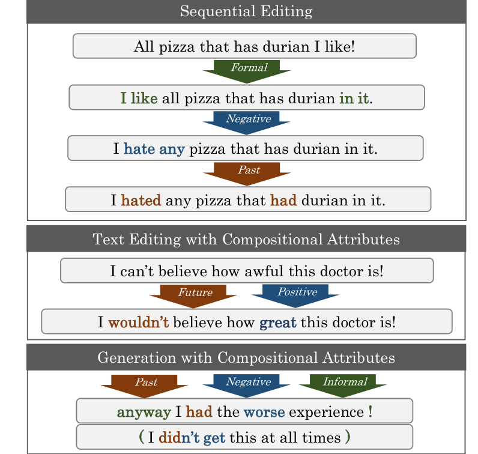
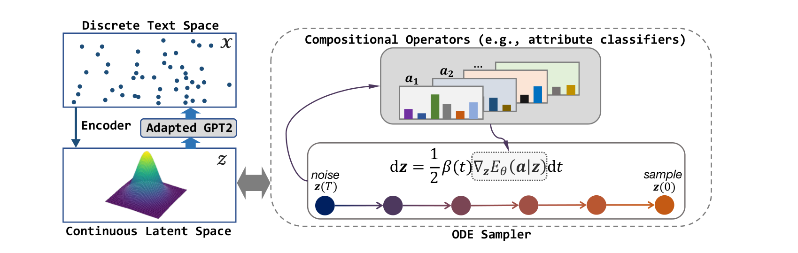

<div align="center">

# LatentOps

### Composable Text Controls in Latent Space with ODEs

**Plug-and-play controllable text generation and text editing by sampling in the compact latent space of a pretrained-LM VAE with an ODE sampler — compose sentiment, tense, formality and keyword controls without retraining.**

[](https://aclanthology.org/2023.emnlp-main.1030/)
[](https://arxiv.org/abs/2208.00638)
[](LICENSE)
[](#environment)
[](#environment)

[Guangyi Liu](https://guangyliu.github.io)<sup>1,3†</sup>, Zeyu Feng<sup>2</sup>, Yuan Gao<sup>2</sup>, Zichao Yang<sup>4</sup>, Xiaodan Liang<sup>3,5</sup>, Junwei Bao<sup>6</sup>, Xiaodong He<sup>6</sup>, Shuguang Cui<sup>1</sup>, Zhen Li<sup>1</sup>, Zhiting Hu<sup>2</sup>

<sup>1</sup>FNii, CUHK-Shenzhen · <sup>2</sup>UC San Diego · <sup>3</sup>MBZUAI · <sup>4</sup>Carnegie Mellon University · <sup>5</sup>DarkMatter AI Research · <sup>6</sup>JD AI Research
<br><sub>† Work done while a Ph.D. candidate at CUHK-Shenzhen</sub>





</div>

---

## TL;DR

Real-world text applications need to **compose** many controls at once — flip the sentiment, change the tense, make it formal, keep a keyword — and to do that on both *new* text (generation) and *existing* text (editing). Doing this token-by-token in the sequence space of an autoregressive LM (PPLM, FUDGE, …) is slow and the controls fight each other.

LatentOps instead works in a **compact latent space**:

1. **Latent-space LM.** A pretrained GPT-2 is cheaply adapted into a VAE (BERT-small encoder → 64-d latent `z` → GPT-2 decoder, only a small set of new parameters trained), so that every sentence has a vector `z` and every `z` decodes to a sentence.
2. **Operators as energies.** Each control is a tiny classifier `p(a | z)` on the latent (3.7K parameters for a 2-way attribute, trained from **200 labels per class**). Any set of controls is composed by *adding their energies*: `E(z) = −Σᵢ log p(aᵢ | z) + ‖z‖²/2`.
3. **ODE sampler.** Instead of noisy Langevin dynamics, we draw samples from the composed energy-based distribution by solving a probability-flow **ordinary differential equation** in latent space (`torchdiffeq`). This is deterministic, stable, and — because the latent is 64-d — fast: **6.6× faster than FUDGE and 578× faster than PPLM** for the same job.
4. **Editing = encode → move → decode.** To edit a sentence, encode it, run the ODE from its `z` toward the desired attributes, decode. Controls can be applied sequentially or all at once, and new operators can be added later without touching the LM.

**Keywords:** controllable text generation · text style transfer · text editing · composable / compositional control · latent space · variational autoencoder (VAE) · pretrained language model (GPT-2) · energy-based model (EBM) · ODE sampler · plug-and-play · few-shot attribute classifiers · sentiment · tense · formality · keywords.

---

## Results

**Generation with compositional attributes** (Yelp; sentiment + tense + formality at once; accuracy per attribute, geometric mean, PPL, self-BLEU↓ for diversity):

| Method | Acc. S / T / F | G-Mean ↑ | PPL ↓ | sBLEU ↓ | time for 150 samples |
|---|---|---|---|---|---|
| PPLM | 0.82 / 0.57 / 0.56 | 0.64 | 17.5 | 30.5 | 3182 s |
| FUDGE | 0.67 / 0.64 / 0.62 | 0.64 | 11.5 | 35.9 | 36.1 s |
| **LatentOps** | **0.97 / 0.92 / 0.93** | **0.94** | 25.8 | **21.1** | **5.5 s** |

**Text editing with a single attribute** (sentiment transfer; Yelp review dataset; 1,000 test sentences with human references):

| Method | Acc. ↑ | ref-BLEU ↑ | PPL ↓ | Human ↑ | #Trainable params | Labelled data |
|---|---|---|---|---|---|---|
| B-GST | 0.81 | 16.3 | 39.5 | 2.03 | 111M | full (~440K) |
| Style Transformer | 0.91 | 24.5 | 41.0 | 2.20 | 17M | full |
| DiRR | **0.96** | **29.8** | **23.9** | 3.13 | 1.5B | full |
| FUDGE | 0.40 | 18.0 | 39.3 | 1.20 | 16.4M | few-shot |
| **LatentOps** | 0.95 | 24.3 | 25.9 | **3.27** | **3.7K** | **few-shot (400)** |

Amazon and the full metric set (input-BLEU, CTC, MAUVE, LogVar), sequential editing, keyword operators (613 keywords) and the ODE-vs-SGLD-vs-SDE ablation are in the paper. The exact outputs behind the Yelp/Amazon sentiment-transfer rows are in [`outputs/style_transfer/`](outputs/), aligned line-by-line with the Li et al. (2018) test set and human references, so you can re-score them with your own metrics.

---

## Quick start

### Environment

```bash
conda create -n latentops python==3.9.1 pytorch==1.11.0 torchvision==0.12.0 cudatoolkit=11.3 -c pytorch
conda activate latentops
bash build_envs.sh            # pip install -r requirements.txt
# bash build_envs.sh --with-apex   # optional, only for --fp16 training
```

### Data

```bash
bash download_datasets.sh      # = python data/prepare_data.py --datasets yelp amazon
```

This rebuilds `data/datasets/{yelp,amazon}_data/` from the public Li et al. (2018)
corpora (CC BY-SA 4.0): VAE training text, 200-per-class sentiment classifier files,
GAN initialisation text, the 1,000-sentence style-transfer test set and its human
references. Add `--keywords food service ...` to also build keyword-operator files.
See [`data/README.md`](data/README.md) for every file and its format.

> **Pretrained checkpoints.** The VAE checkpoints (`base_yelp`, `large_yelp`,
> `large_amazon`), the latent classifiers/GAN and the external evaluation classifiers
> that used to be downloadable from a university SharePoint are **no longer available**;
> the hosting was retired and no copy survived. Train them with the scripts below —
> the VAE is the only expensive step (GPT-2-large decoder; hours on one V100), everything
> downstream is minutes.

---

## Pipeline

All commands run from `code/`. Every script has its knobs at the top of the file.

### 1 · Train the latent-space LM (VAE)

```bash
cd code
# edit train_vae.sh: dataset, TRAIN_FILE, TEST_FILE, gpt_size ('base' | 'large')
bash train_vae.sh
```

Encoder `prajjwal1/bert-small`, decoder GPT-2, latent size 64, `fix_model=84` (train only
the latent projection layers and the new decoder parameters). Checkpoints go to
`../ckpts/LM/<dataset>/<name>/`; TensorBoard logs to `code/runs/<dataset>`. Copy or
symlink the finished checkpoint directory to `../ckpts/<name>` (e.g. `../ckpts/large_yelp`)
so the scripts below find it.

### 2 · Train operators (latent classifiers) and the GAN prior

```bash
# edit train_classifier_latent.sh
train_cls_gan='gan'   ckpt_path=../ckpts/large_yelp   TRAIN_FILE=../data/datasets/yelp_data/train_gan.txt
bash train_classifier_latent.sh          # -> ../ckpts/large_yelp/checkpoint-gan-1

train_cls_gan='cls'   cls_step=1  n_classes=2   TRAIN_FILE=../data/datasets/yelp_data/train_sentiment.txt
bash train_classifier_latent.sh          # -> ../ckpts/large_yelp/checkpoint-cls-1
```

`cls_step` is the operator id you will refer to later. Convention used in the paper:
`1` sentiment (0 neg / 1 pos), `4` tense (0 past / 1 present / 2 future), `33` formality
(0 informal / 1 formal); keyword operators use any other id. Data files are
`<label>\t<text>`, one per line — any attribute you can label 200 sentences per class for
becomes an operator.

### 3 · Generate with composed controls

```bash
bash conditional_generation.sh <operator ids> <attribute values>

bash conditional_generation.sh 1 1                     # positive
bash conditional_generation.sh 4 0                     # past tense
bash conditional_generation.sh '1,4' '1,2'             # positive AND future
bash conditional_generation.sh '1,4,33' '1,2,0'        # positive, future, informal
bash conditional_generation.sh '1,4,33' '1,2,0;0,2,0'  # two attribute combinations in one run
```

Outputs land in `../ckpts/<name>/sample/sampling*.txt`. `weight_energy` scales the
operator energies against the prior; `lace_sampling_multiple.sh` sweeps many
combinations at once.

### 4 · Edit existing text

```bash
# edit lace_transfer_yelpnew.sh: name, TEST_FILE (default: ../data/datasets/yelp_data/test_ref.txt),
#   cls_step / att_list (operator ids and target values), repa_num (candidates per input)
bash lace_transfer_yelpnew.sh
```

Each input sentence is encoded, the ODE moves its latent toward the requested attribute
values, and the decoder produces the edit. Set `cls_step=1,4 att_list=1,2` for a
simultaneous sentiment + tense edit, or run the script twice for sequential editing.

### 5 · Evaluate

* **Attribute accuracy** — an external sequence classifier (the paper fine-tuned BERT on the
  full labelled corpus). `modules/eval_sampler.py` expects HF-format models under
  `../classifiers/{sentiment,tense,formality}`; any `AutoModelForSequenceClassification`
  fine-tuned on `train_sentiment.txt`-style data works.
* **Fluency** — perplexity under a GPT-2 fine-tuned on the domain
  (`../classifiers/gpt2_yelp`, same contract).
* **Content** — BLEU of the output against the input (iBL) and against the human
  references (rBL) in `data/datasets/<name>_data/reference.{0,1}`; `nltk` is already a
  dependency.

---

## Repository layout

```
code/
  train_vae.sh, train_vae_amazon.sh      step 1
  train_classifier_latent.sh             step 2  (cls or gan)
  conditional_generation.sh              step 3
  lace_sampling_multiple.sh              step 3, many attribute combinations
  lace_transfer_yelpnew.sh               step 4
  examples/big_ae/
    run_lm_vae_training.py               VAE training
    train_cls_latent.py                  latent classifiers / GAN
    conditional_generation.py            ODE sampling for generation
    lace_sampling_my.py                  batch generation over attribute combinations
    lace_tst_my.py                       ODE-based editing
    modules/                             VAE, encoders, GPT-2 decoder with latent injection, ODE sampler
  legacy/                                exploratory code not used by the paper (see its README)
data/prepare_data.py                     rebuilds the datasets from public sources
outputs/style_transfer/{yelp,amazon}/    our sentiment-transfer outputs on the 1,000-sentence test sets
```

---

## Related work

LatentOps builds on **Optimus** (Li et al., 2020), which first connected BERT and GPT-2
through a sentence-level latent space, and on latent-space energy-based control
(**LACE**, Nie et al., 2021, in images). Compared with sequence-space plug-and-play
control (PPLM, FUDGE, GeDi) the latent formulation makes composition a sum of energies
and turns sampling into a 64-dimensional ODE solve rather than per-token gradient
steps through the LM. If you are looking for follow-ups from the same group on
latent-space generative modelling of text, see
[EDDPM](https://github.com/guangyliu/EDDPM), which treats the VAE's encoding and
decoding as steps of the diffusion process itself.

---

## Citation

```bibtex
@inproceedings{liu-etal-2023-composable,
  title     = {Composable Text Controls in Latent Space with {ODE}s},
  author    = {Liu, Guangyi and Feng, Zeyu and Gao, Yuan and Yang, Zichao and Liang, Xiaodan and
               Bao, Junwei and He, Xiaodong and Cui, Shuguang and Li, Zhen and Hu, Zhiting},
  booktitle = {Proceedings of the 2023 Conference on Empirical Methods in Natural Language Processing (EMNLP)},
  year      = {2023},
  publisher = {Association for Computational Linguistics},
  url       = {https://aclanthology.org/2023.emnlp-main.1030},
  eprint    = {2208.00638},
  archivePrefix = {arXiv}
}
```

## Acknowledgements

The VAE code started from [Optimus](https://github.com/ChunyuanLI/Optimus); the
ODE sampler uses [`torchdiffeq`](https://github.com/rtqichen/torchdiffeq); datasets are the
Yelp/Amazon corpora released by [Li et al. (2018)](https://github.com/lijuncen/Sentiment-and-Style-Transfer).
